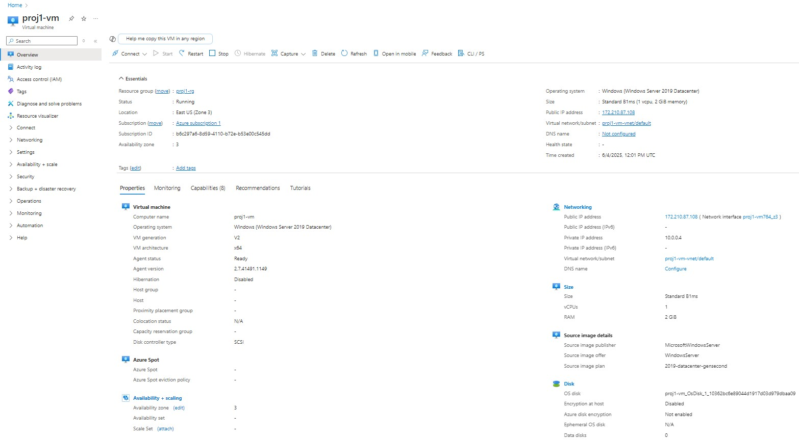
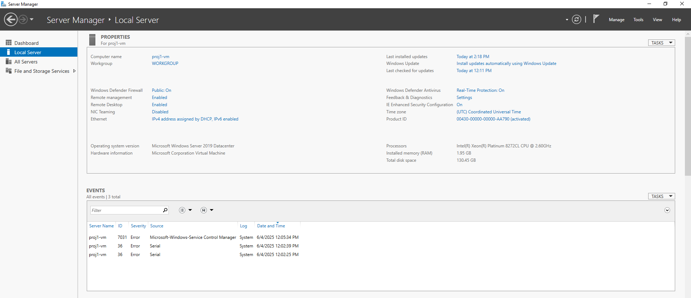
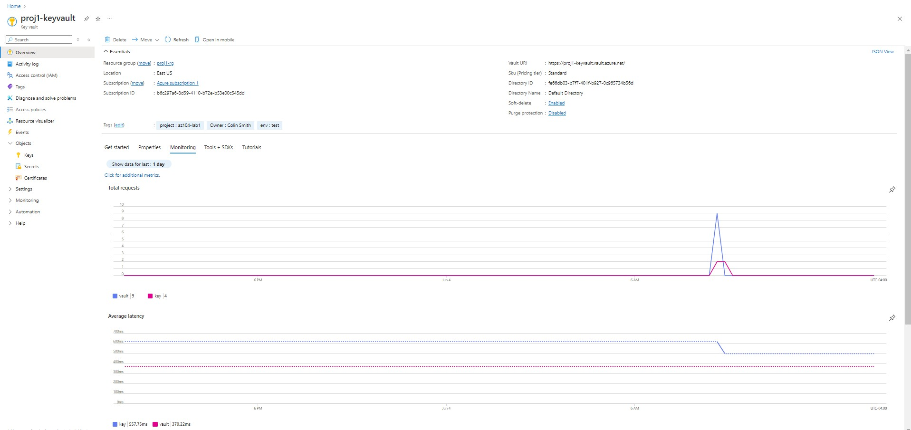
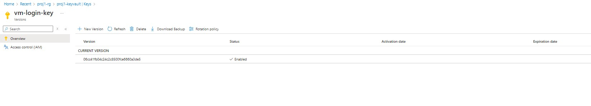
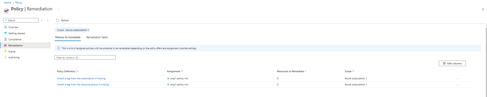
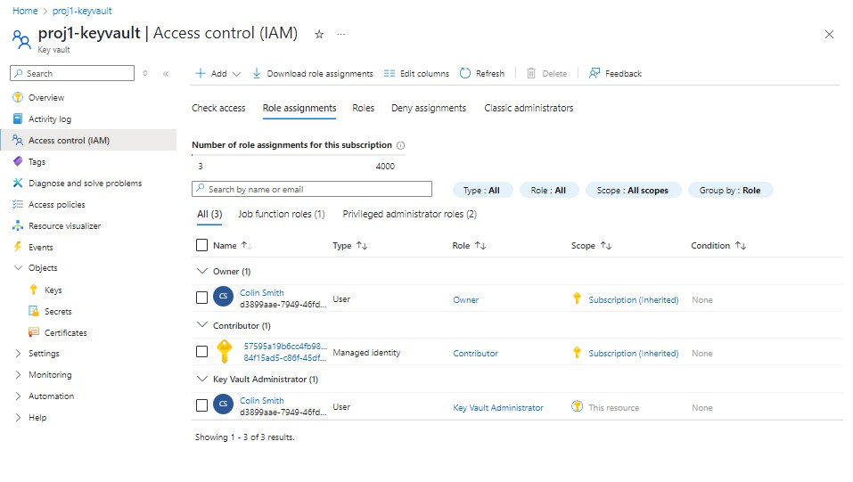
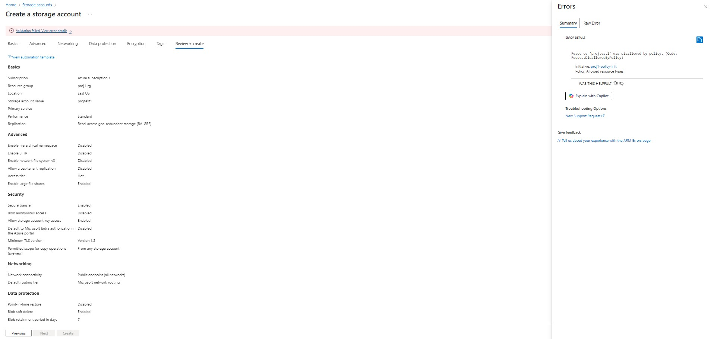
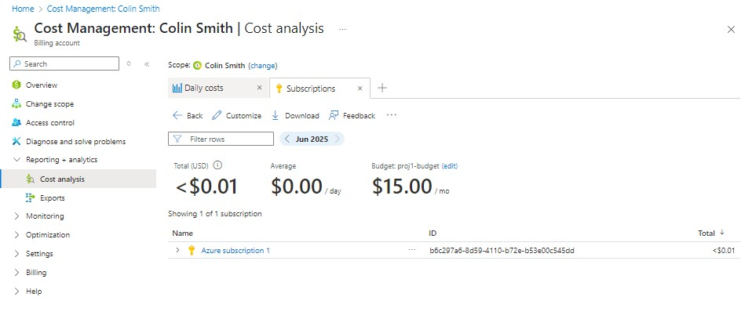

# Azure Management Project
Azure project demonstrating VM deployment, RBAC, Key Vault, Policy enforcement, and cost monitoring in Azure.

# Azure Management Project (AZ-104 Aligned)

This project demonstrates core Azure administration skills including VM provisioning, RBAC configuration, secure key storage, policy enforcement, and cost monitoring. It follows a real-world use case aligned with AZ-104 Microsoft Azure Administrator certification topics.

---

## 🚀 Project Overview

**Scenario:**  
A company needs a secure and cost-monitored Azure Virtual Machine (VM) deployment, with strong access control, enforced governance policies, and resource tagging inherited across services.

**Technologies Used:**
- Azure Virtual Machines
- Azure Key Vault
- Azure Policy
- Azure RBAC / Entra ID
- Azure Cost Management
- RDP into Windows Server

---

## ✅ What I Did

- Deployed a Windows Server 2019 VM with NSG, static IP, and attached disk
- Created a Key Vault to store login credentials securely
- Assigned **Key Vault Administrator** role using Azure RBAC
- Enforced governance using **Azure Policy** with tag inheritance
- Set a monthly budget with email alerts using **Cost Management**
- Verified access by logging into the VM and inspecting Server Manager
- Tested policy enforcement by attempting to deploy a blocked resource

---

## 📸 Screenshots

| Task | Screenshot |
|------|------------|
| VM Provisioned |  |
| Inside the VM via RDP |  |
| Key Vault Created |  |
| Key Generated in Vault |  |
| Tags Applied to Vault |  |
| RBAC Configured |  |
| Policy Enforcement Worked |  |
| Budget & Cost Tracking |  |

---

## 🧠 Skills Demonstrated

- Azure VM provisioning + network configuration
- Role-Based Access Control (RBAC) with least privilege
- Secure key storage and access via Key Vault
- Policy-based governance using initiatives and tag inheritance
- Budgeting, cost control, and usage tracking
- Hands-on troubleshooting through policy failure messages
- RDP into a VM to validate service state and OS config

---

## 📂 Repo Structure

```bash
azure-mgmt-project/
├── README.md
├── /screenshots/
│   ├── vm-overview.png
│   ├── vm-server-manager.png
│   ├── keyvault-overview.png
│   ├── keyvault-tags.png
│   ├── rbac-keyvault-admin.png
│   ├── policy-remediation.png
│   ├── policy-enforcement-error.png
│   └── cost-mgmt-analysis.png
